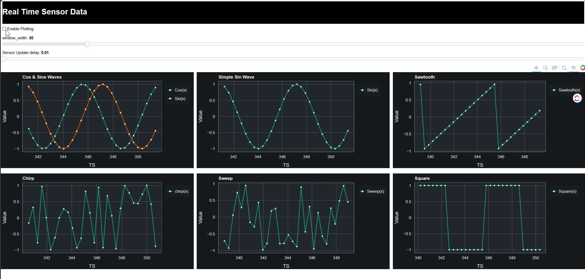

# Instructions
### To run 
```sh
git clone https://github.com/hidara2000/fast_sensor_stream.git

cd fast_sensor_stream
pip install -r requirements.txt

bokeh serve --show bokeh_stream
```

#### OUTPUT in BROWSER

> video
<video src="live%20sensor.mp4" controls title="Title"></video>


https://github.com/hidara2000/fast_sensor_stream/assets/15170494/54571ddb-683d-4edf-a13f-bb2f46bff57d


### NOTES
- Still a work in progress
- All code relating to delay can be deleted when using real sensor data but if the data streams at more than 100HZ and you have multiple plots add a delay of around 0.005->0.01secs in the run loop below
- for real data just replace the Sensor class with something similar to below
    ``` python
    class Sensor(Thread):
        def __init__(self, plt: "BokehPlot", fn: Callable, delay_queue: Queue=None):
            """Initialise pretend sensor data. This can be replaced with real data based on project

            Args:
                plt (BokehPlot): plot to display the data
                fns (Dict): function to generate plot data
                delay_queue (Queue): set selay before each update
            """
            Thread.__init__(self)

            self.ys = {}
            self.x = 0
            self.fn = fn

            self.sensor_callback = plt.update
            self.bokeh_callback = plt.doc.add_next_tick_callback


        def run(self):
            """Generate data
            """
            while True:
                # using your own sensor reading function ensure it returns a list as follows
                # [x_val, {dict of ys}]
                # where {dict of ys} is as follows for one line in a plot
                #
                # {'y': <latest_sensor_reading>}
                #
                # or multiple lines in a plot eg gyro or accelerometer
                #
                #  {'y': <latest_sensor_reading_0>,
                #  'y1': <latest_sensor_reading_1>,
                #  'y2': <latest_sensor_reading_2>,
                #  'y3': <latest_sensor_reading_3>,
                #                  ...
                #  'yn': <latest_sensor_reading_n>}
                # this will plot n lines in a single plot
                x, ys = fn.read_sensor_data()

                self.data = {y_key: [y_value] for y_key, y_value in ys.items()}
                self.data["x"] = [self.x]

                self.bokeh_callback(partial(self.sensor_callback, self.data))
    ```
    and adjust the code in main so that it just sends the sensor read function and adjust the dictionary to reflect title, legend values etc

### KNOWN ISSUES
sometimes following error occurs. Could be to do will all plots using the same update callback (plt.doc.add_next_tick_callback) function. Will address it later    
```
AttributeError: 'DocumentCallbackManager' object has no attribute '_change_callbacks'
```
